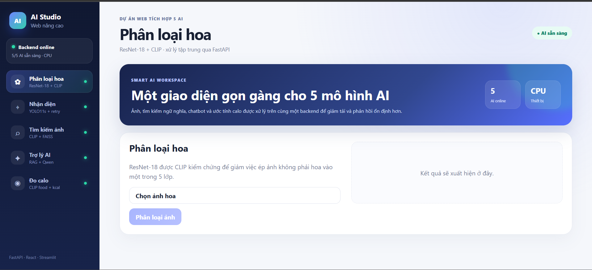
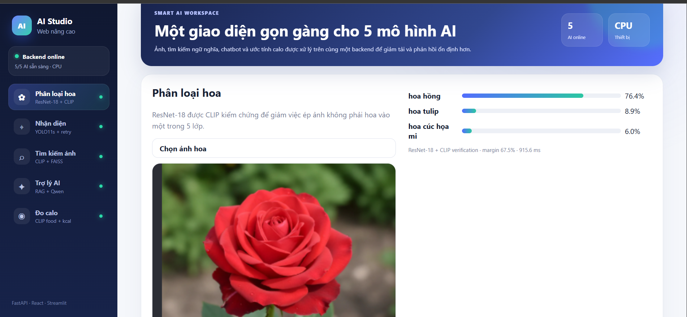
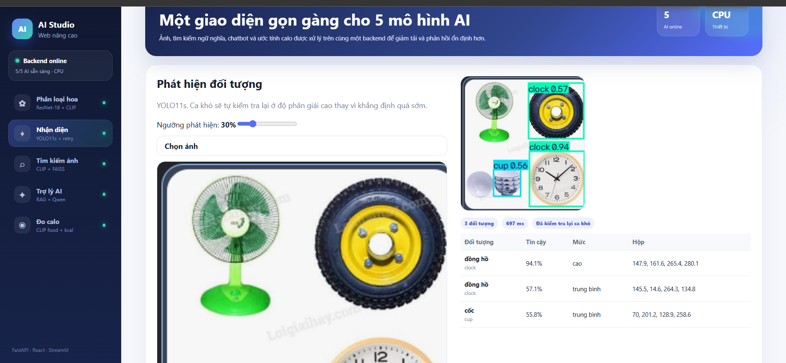
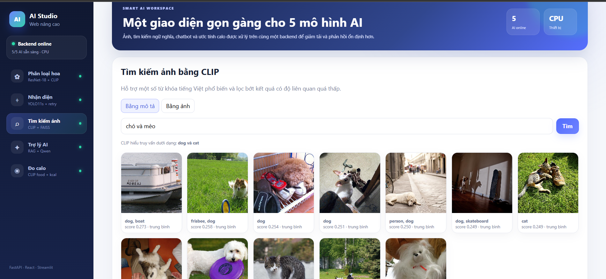
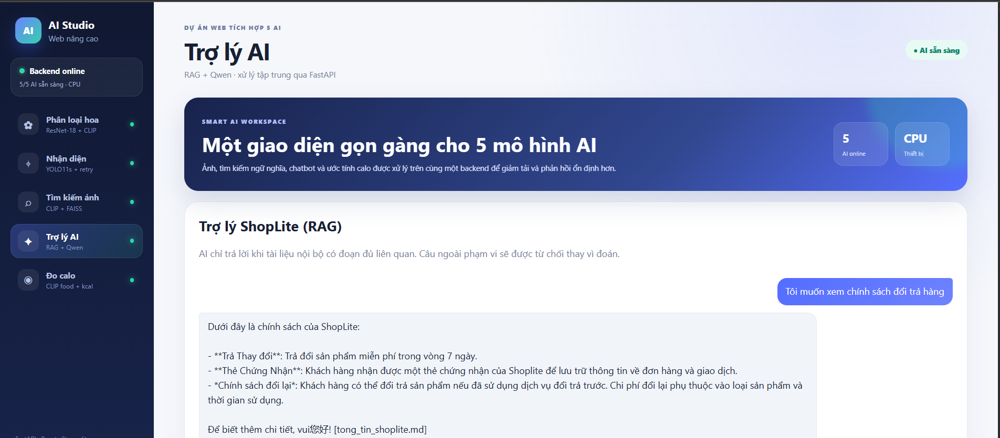
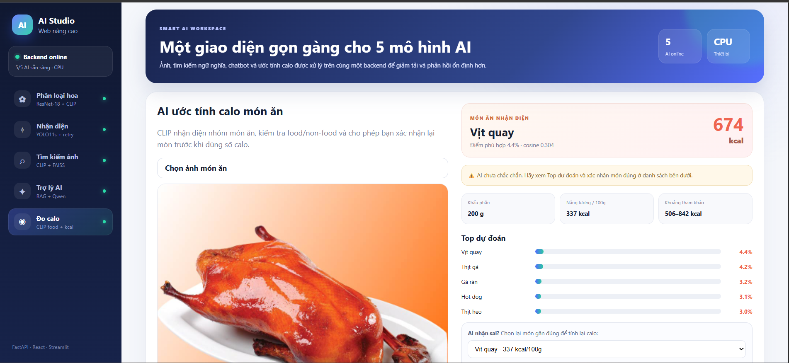

# 🤖 DỰ ÁN WEB TÍCH HỢP 5 AI

Website tích hợp **5 chức năng AI** trong cùng một hệ thống, sử dụng **FastAPI** làm backend và **React / Streamlit** làm giao diện.

## 🚀 Các chức năng AI

| #   | Chức năng                     | Công nghệ chính                      |
| --- | ----------------------------- | ------------------------------------ |
| 1   | Phân loại 5 loài hoa          | ResNet-18 + CLIP kiểm chứng          |
| 2   | Nhận diện đối tượng trong ảnh | YOLO11s                              |
| 3   | Tìm kiếm ảnh bằng ngữ nghĩa   | CLIP + FAISS                         |
| 4   | Chatbot hỏi đáp tài liệu      | RAG + Qwen + MiniLM                  |
| 5   | Ước tính calo món ăn          | CLIP zero-shot + bảng kcal tham khảo |

> Bản hiện tại ưu tiên **không khẳng định khi AI chưa đủ chắc chắn**. Với các trường hợp yếu hoặc ngoài dữ liệu, hệ thống sẽ cảnh báo thay vì cố ép ra một kết quả.

---

## 1. Giao diện chính



## 2. Phân loại hoa



## 3. Nhận diện đối tượng bằng YOLO



## 4. Tìm kiếm ảnh bằng CLIP + FAISS



## 5. Chatbot RAG



## 6. Ước tính calo món ăn



---

# 🧱 Kiến trúc hệ thống

```text
React / Streamlit
        │
        ▼
     FastAPI
        │
        ├── ResNet-18 + CLIP
        ├── YOLO11s
        ├── CLIP + FAISS
        ├── RAG + Qwen
        └── Calorie Estimator
```

Cấu trúc thư mục chính:

```text
DuAnWedNangCao_beautiful/
├── api/
│   └── main.py
├── core/
│   ├── classifier.py
│   ├── detector.py
│   ├── retrieval.py
│   ├── llm.py
│   └── calorie.py
├── data/
│   ├── kb/
│   └── nutrition_calorie.json
├── artifacts/
├── tests/
├── web/
│   └── src/
├── config.py
├── streamlit_app.py
├── requirements.txt
├── verify_ai.py
└── README.md
```

---

# ⚙️ Yêu cầu môi trường

Khuyến nghị:

```text
Python 3.11
Node.js 22
Git
VS Code
```

Project cũng có thể chạy trên môi trường Python mới hơn nếu các dependency tương thích.

---

# 📦 Cài đặt

## 1. Cài thư viện Python

Mở Terminal tại thư mục gốc project:

```bash
pip install -r requirements.txt
```

Nếu bạn đã có môi trường ảo `.venv`:

```bash
source ~/.venv/Scripts/activate
```

## 2. Cài thư viện React

```bash
cd web
npm install
```

`npm install` chỉ cần chạy lần đầu hoặc khi `package.json` thay đổi.

---

# ▶️ Cách chạy project

Project cần chạy **backend FastAPI** và **frontend React** song song.

## Terminal 1 — chạy FastAPI

Đứng tại thư mục gốc project:

```bash
source ~/.venv/Scripts/activate
uvicorn api.main:app --reload
```

Chờ đến khi Terminal xuất hiện:

```text
INFO: Application startup complete.
```

Backend mặc định:

```text
http://127.0.0.1:8000
```

Swagger API:

```text
http://127.0.0.1:8000/docs
```

Kiểm tra trạng thái model:

```text
http://127.0.0.1:8000/api/health
```

---

## Terminal 2 — chạy React

Mở Terminal mới:

```bash
cd web
npm run dev
```

Khi Vite hiển thị:

```text
Local: http://localhost:5173/
```

mở trình duyệt:

```text
http://localhost:5173
```

---

# 🖥️ Chạy giao diện Streamlit

Nếu muốn dùng giao diện Streamlit thay cho React:

```bash
source ~/.venv/Scripts/activate
streamlit run streamlit_app.py
```

Sau đó mở:

```text
http://localhost:8501
```

---

# ✅ Kiểm tra trước khi demo / nộp bài

## Unit/API test

```bash
ENABLED_MODELS= python -m pytest -q
```

## Kiểm tra model thực tế

Sau khi đã có dataset và artifact cần thiết:

```bash
python verify_ai.py
```

Báo cáo được ghi vào:

```text
artifacts/verification_report.json
```

Nếu có `WARN`, điều đó không nhất thiết có nghĩa chương trình bị lỗi; đây là tín hiệu cần kiểm tra lại chất lượng model hoặc dữ liệu.

---

# 🧠 Chi tiết 5 AI

## 1. Phân loại hoa

Mô hình chính sử dụng **ResNet-18**, kết hợp **CLIP** để kiểm chứng kết quả. Hệ thống có thể từ chối ảnh ngoài 5 lớp hoặc cảnh báo khi hai mô hình không đồng thuận đủ mạnh.

Các lớp:

```text
daisy
dandelion
roses
sunflowers
tulips
```

## 2. Nhận diện đối tượng

Sử dụng **YOLO11s** để ưu tiên độ chính xác hơn bản YOLO11n nhẹ.

Với detection yếu, hệ thống có thể chạy kiểm tra lại ở độ phân giải cao hơn và hiển thị cảnh báo thay vì coi kết quả là chắc chắn.

## 3. Tìm kiếm ảnh

Sử dụng:

```text
CLIP
+
FAISS
```

Người dùng có thể tìm ảnh bằng mô tả hoặc ảnh mẫu. Bản hiện tại hỗ trợ thêm một số từ khóa tiếng Việt và giảm hiển thị kết quả quá yếu.

## 4. Chatbot RAG

Chatbot sử dụng tài liệu trong:

```text
data/kb/
```

Luồng xử lý:

```text
Câu hỏi
  ↓
MiniLM embedding
  ↓
FAISS retrieval
  ↓
Qwen
  ↓
Câu trả lời
```

Nếu tài liệu không đủ liên quan, chatbot sẽ ưu tiên trả fallback thay vì tự suy đoán.

## 5. Ước tính calo

Bản hiện tại sử dụng **CLIP zero-shot** với nhóm nhãn món ăn mở rộng.

Người dùng:

```text
Upload ảnh món ăn
        ↓
AI nhận diện / xếp hạng món
        ↓
Người dùng nhập khối lượng (gram)
        ↓
Tra kcal / 100g
        ↓
Ước tính tổng kcal
```

Kết quả calo chỉ mang tính **tham khảo/demo**, vì một ảnh không thể xác định chính xác lượng dầu, nước sốt, nguyên liệu ẩn hay khối lượng thực tế.

---

# 📌 Lưu ý khi clone từ GitHub

Repository không đưa lên các thư mục/file quá lớn như:

```text
.venv/
web/node_modules/
data/flowers/
data/coco128/
data/gallery/
*.pt
artifacts/retrieval/index.faiss
```

Vì vậy người clone project cần cài dependency và chuẩn bị model/artifact theo hướng dẫn của project trước khi sử dụng đầy đủ mọi chức năng.

---

# 🛠️ Công nghệ sử dụng

```text
Python
FastAPI
PyTorch
Ultralytics YOLO
Transformers
Sentence-Transformers
CLIP
FAISS
React
Vite
Streamlit
```

---

# 👨‍💻 Demo nhanh khi chấm bài

1. Chạy FastAPI.
2. Chạy React.
3. Mở `http://localhost:5173`.
4. Kiểm tra `/api/health`.
5. Demo lần lượt:
   - Phân loại hoa.
   - Nhận diện đối tượng.
   - Tìm kiếm ảnh.
   - Chatbot RAG.
   - Ước tính calo.
6. Nếu cần kiểm chứng chất lượng, chạy `python verify_ai.py`.

---

## ⚠️ Ghi chú

AI thị giác không thể bảo đảm đúng 100% với mọi ảnh ngoài dữ liệu huấn luyện. Project được thiết kế để hiển thị cảnh báo hoặc trạng thái không chắc chắn thay vì luôn ép model đưa ra kết luận.
